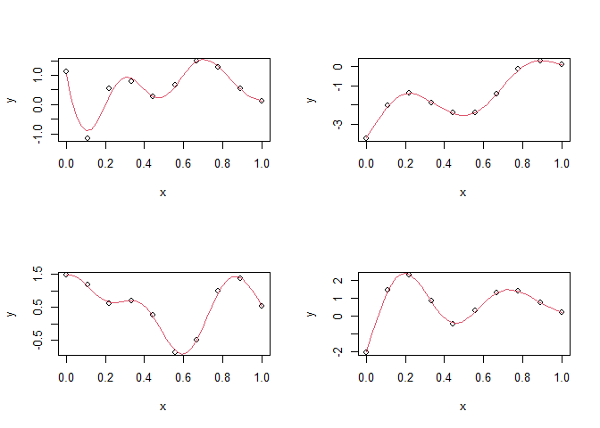

Gaussian Processes
================
Robin Aldridge-Sutton
07/05/2022

``` r
# Functions to sample from and predict values of a Gaussian process.
source("GP funcs.R")
```

A Gaussian process (GP) is a distribution over functions such that for
any finite set of input values the function values have a multivariate
Gaussian distribution.

A GP can be used as a functional prior. The posterior is then the
conditional distribution of functions given observed function values at
a set of input values.

I usually think of the prior being on parameters in a model for the
data, and the posterior coming from the likelihood and the probability
of the data with

$$p(a\|x) = \\frac{p(a) p(x\|a)}{p(x)}.$$

But I guess you can also put a prior on the data itself, and get a
posterior by conditioning on the observed values

$$p(x_1\|x_2) = \\frac{p(x_1, x_2)}{p(x_2)}.$$

*f*(**x**) ∼ *G**P*(*μ*(**x**)=**0**,*Σ*=*K*(**x**,**x**)),
$$K(\\mathbf{x}, \\mathbf{x}')\_{i, j} = \\sigma_f^2 \\exp\\left(\\frac{(x_i - x'\_j)^2}{2 l^2} \\right)$$
**y** = *f*(**x**) + *ϵ*,
*ϵ* ∼ *N*(0,*σ*<sub>*n*</sub><sup>2</sup>*I*<sub>*d*</sub>)
**x** ∈ ℝ<sup>*d*</sup>

``` r
par(mfrow = c(2, 2))

for (i in 1:4)
  plot_GP(
    n_samp = 10, # Number of points to sample
    n_pred = 40, # Number of data points to predict
    l = 0.2, # Length scale
    sigma_f = 2, # Function standard deviation
    sigma_n = 0.1 # Noise standard deviation
  )
```

<!-- -->
